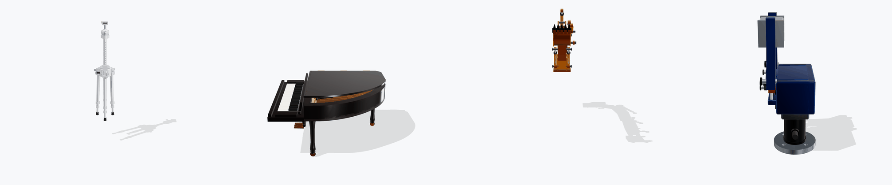

<h1 align="center">Articraft</h1>

<p align="center">
  <b>Generate articulated 3D objects</b>
</p>

<p align="center">
  <a href="LICENSE"></a>
  
  
  
</p>

<p align="center">
  
</p>

> [!NOTE]
> Articraft is the supported successor to the
> [original harness](https://github.com/mattzh72/articraft).
> Researchers and engineers from academia and industry maintain and support this project.
> It is under active development; expect changes before version 1.0.

<details>
<summary>The prompts behind these eight objects</summary>

<br>

Each object above came from one prompt, with no reference image and no hand modeling.
Naming the real construction is what earns the detail.

**An excavator arm**

> A hydraulic excavator arm assembly, built to look real. A slewing mount, a boom, a stick,
> and a digging bucket on pivot pins, driven by three hydraulic cylinders: paired boom
> cylinders on the mount, a stick cylinder along the boom, and a bucket cylinder working
> through a bell crank and dogbone link. The bucket is an open scoop: a curved back plate that
> wraps from its pivot down and forward, two flat side walls closing the ends, a straight
> cutting edge across the front carrying five pointed teeth, and an open mouth facing forward
> so it reads as a bucket rather than a drum. Each cylinder is a barrel with a polished rod
> that extends as its joint moves, staying pinned at both eyes through the whole range. Model
> the visible construction: the pin bosses and retainer plates, the hose runs, the weld seams
> along the boom box section. Swing the boom, stick and bucket across their range and prove
> every cylinder stays pinned and nothing passes through anything else.

**A folding camera tripod**

> A folding camera tripod, built to look real. Three legs on a shouldered hub, each folding
> out and each telescoping through three tapered tubes with twist lock collars and rubber
> feet. A geared center column with a hook underneath, and a ball head on top with a quick
> release plate, a pan lock knob, a tilt notch, and a bubble spirit level. Model the visible
> construction: knurling on the collars, the leg angle stops, hinge lugs, and fasteners.
> Sample the legs and column across their range and prove nothing passes through anything
> else.

**An aircraft landing gear leg**

> An aircraft landing gear leg, built to look real. A forged trunnion at the top, an oleo
> strut whose polished piston telescopes into its cylinder, a hinged side stay that folds at
> its knee, and a retraction actuator whose rod drives the leg up into the bay. A twin wheel
> axle with disc brakes, a torque link scissor between the strut halves, and the drag brace
> pinned at both ends. Model the visible construction: the pin joints and retainer plates, the
> hydraulic lines, the scissor link, the brake calipers. Retract and extend the gear and prove
> the stays stay pinned and nothing passes through anything else.

**An architect's desk lamp**

> An architect's desk lamp, built to look real. A weighted disc base, a lower arm and an upper
> arm that each hold the shade level through a parallel four bar linkage, and the balance
> springs hooked between the arm plates. A perforated conical shade on a swivel head, a bulb
> inside, and knurled friction knobs at every pivot. Model the visible construction: the
> paired arm plates, the pivot rivets, the spring hooks and their anchors, and the cable
> clipped along the arms. Sweep both arms across their range and prove the shade stays level
> and nothing passes through anything else.

**A scissor lift platform**

> A scissor lift platform, built to look real. A wheeled steel base frame, two crossed leg
> pairs pinned at their midpoints with the upper ends riding rollers in a channel under the
> deck, and a hydraulic cylinder between the lower legs that raises the whole stack. A diamond
> plate deck with a folding guard rail and a toe board. Model the visible construction: the
> pivot pins and retaining plates, the roller channels, the cylinder eyes and rod, the ladder
> rungs on the base. Raise and lower the platform across its range and prove the crossed legs
> stay pinned and nothing passes through anything else.

**A baby grand piano**

> A baby grand piano, built to look real from every angle. Include the distinctive bent side
> and straight spine, a curved rim, the fallboard over the keys, a music desk, a full 88 key
> keyboard with correct black key grouping, and a lyre under the keybed carrying three pedals
> sized like real ones so they sit under the keyboard rather than jutting past the case front.
> The lid opens on its hinge and is held by a prop stick that must fold down flat into the
> case when the lid closes: sample the lid and prop across their whole range and prove they
> never pass through each other. Model visible construction: hinges, the lid seam, legs with
> real profiles, casters.

**A two finger robotic gripper**

> A two finger robotic gripper, built to look real, with the jaws open and nothing held
> between them. An anodized body housing a lead screw driven slider, two fingers on pivot pins
> driven by dogbone linkages, and replaceable jaw pads with machined gripping grooves. Keep
> the body compact relative to the jaws so the gripping mechanism is the obvious feature, and
> leave the space between the pads empty. Include the motor can and gearbox, a cable gland,
> cap head fasteners, dowel pins, and a mounting flange. Model the visible construction: the
> dogbone links and their pins, the slider ways, the pad fasteners. Open and close the fingers
> across their range and prove the linkages stay pinned and nothing passes through anything
> else.

**A pair of locking pliers**

> A pair of locking pliers, built to look real, with the deep curved jaws as the obvious
> feature. The fixed jaw is forged into the fixed handle and the moving jaw pivots on a rivet
> through it, both jaws carrying coarse cross serrations on their inner faces and meeting in
> the characteristic curved gap that grips a pipe. A moving handle pinned to the moving jaw,
> an over centre toggle link between that handle and the adjusting screw so the tool snaps
> locked, a knurled adjusting screw threaded through the end of the fixed handle, and a wire
> release lever inside the moving handle. Make the jaws large relative to the handles so the
> tool reads as pliers from any angle. Model the visible construction: the pivot rivets and
> washers, the serrations, the screw knurling, the stamped size marking. Open and close the
> jaws through the toggle's range and prove the linkage stays pinned and nothing passes
> through anything else.

</details>

## Highlights

- **Prompt in, posable object out.** Describe what you want and get a USDZ with working joints.
- **The agent writes Python.** It builds the model with the SDK, compiles it, and reads its own
  test results to fix what is wrong.
- **Real physics, not just shapes.** Parts get mass from material densities, plus colliders,
  friction, and joint limits.
- **Checked in a physics engine.** Drop it on a floor or release its joints and see if it stands
  up and holds together.
- **Browser viewer.** Open any run and drag the joints through their range.
- **Works with OpenAI, Anthropic, Gemini, and OpenRouter.**


## Quickstart

Install the package and the development tools:

```shell
uv sync --group dev
```

Add your OpenAI API key to `.env`:

```shell
OPENAI_API_KEY=your_key_here
```

Generate an object:

```shell
uv run articraft "a jet engine"
```

Add one local reference image when you want to reconstruct an object:

```shell
uv run articraft --image reference.png "reconstruct this desk lamp"
```

Each run is in the `runs/` directory. Open a completed run in the browser viewer:

```shell
uv run articraft view runs/<run-id>
```

Use the viewer to examine each generated version and move its joints.

## Simulate a run

Export validation says the USD is well formed. Simulation says whether the object
stands up. Drop a run on a floor and see what happens:

```shell
uv sync --group sim
uv run articraft simulate runs/<run-id>
```

```
2 bodies, 0.990 kg total
  lowest body: +0.0400 -> +0.0198 m
  contacts at rest: 3
  deepest penetration: -5.68 mm on impact, -0.26 mm at rest
  largest part separation change: +0.00 mm
  residual velocity: 0.0034
  verdict: stands up
```

Tilt the floor until it slides, which measures the friction its materials
declared instead of taking it on faith:

```shell
uv run articraft simulate runs/<run-id> --scenario tilt --seconds 8
```

```
  slipped at: 42.3 deg of tilt
  friction: measured 0.91, authored 0.85
```

Let the joints fall from mid-travel, which is the motion an articulated object is
actually for:

```shell
uv run articraft simulate runs/<run-id> --scenario release
```

```
  joints released from mid-travel
  peak joint speed: 6.20 per second
```

Every run records its motion, so `articraft view` gains a **Play
simulation** switch that replays it in the same viewer used to pose joints.
MuJoCo is optional, so the `sim` group is not installed by default.

A passing run covers geometry, mass, joints, and sliding friction. It does not
cover restitution: MuJoCo has no such parameter, and static friction has nowhere
to go in its single sliding coefficient. Those values still export for engines
that read them.

## Use it from Python

Call the same generation loop directly from Python:

```python
import articraft

result = articraft.generate(
    "reconstruct this desk lamp",
    image="reference.png",
    provider="anthropic",
    model="claude-sonnet-5",
    on_event=print,
)

print(result.status, result.run_dir, result.artifact)
```

`generate()` blocks until the run finishes. Pass `on_event` to receive progress
events as they happen.

Async applications use the native coroutine:

```python
async def main():
    result = await articraft.generate_async(
        "reconstruct this desk lamp",
        image="reference.png",
        on_event=print,
    )
    print(result.status, result.artifact)
```

`generate_async()` works with normal asyncio tasks, cancellation, and timeouts.
Cancellation takes effect at the next await point. A compile already in progress
finishes before cancellation completes so it is not abandoned in the background.

## Providers and models

OpenAI is the default provider. To use Gemini, pass a Gemini API key and select the provider:

```shell
GEMINI_API_KEY=your_key_here uv run articraft \
  --provider gemini --model gemini-3.6-flash "make a folding chair"
```

To use Anthropic, pass an Anthropic API key and select the provider:

```shell
ANTHROPIC_API_KEY=your_key_here uv run articraft \
  --provider anthropic --model claude-sonnet-5 \
  --image reference.png "reconstruct this folding chair"
```

<details>
<summary><b>Model catalog, unknown slugs, and OpenRouter</b></summary>

<br>

The local model catalog tracks current pricing and context metadata for:

- OpenAI GPT-5.6: `gpt-5.6` / `gpt-5.6-sol`, `gpt-5.6-terra`, and `gpt-5.6-luna`.
- Anthropic Claude 5: `claude-fable-5`, `claude-mythos-5`, `claude-opus-5`, and
  `claude-sonnet-5` (`claude-mythos-5` is invitation-only).
- Google production models: `gemini-3.6-flash` and `gemini-3.5-flash-lite`.

These families expose roughly 1M-token API context windows. Articraft keeps its existing
272k working budget for compaction and TUI context tracking.

Other model slugs are passed through to the selected provider. The live TUI warns when a slug
has no local metadata, so context tracking and cost estimates are unavailable. If the provider
rejects the slug, the run fails with the provider error.

Each run keeps the complete Anthropic response blocks in `conversation.jsonl`.

To use OpenRouter, provide an API key:

```shell
OPENROUTER_API_KEY=your_key_here uv run articraft \
  --provider openrouter "make a folding chair"
```

OpenRouter defaults to `nvidia/nemotron-3-ultra-550b-a55b:free`. You can select another model
with `--model` or `ARTICRAFT_OPENROUTER_MODEL`.
The OpenRouter lane is text-only, so it omits image tools and related agent instructions.
Optional `OPENROUTER_HTTP_REFERER` and `OPENROUTER_APP_TITLE` values enable OpenRouter app
attribution. OpenRouter reports token usage and request cost when available. Because arbitrary
model identifiers are accepted without a local model catalog, their context window is reported as
unknown and the TUI omits its context-percentage display.

</details>

## Run the checks

```shell
uv run pytest -q --replay
uv run ruff check .
```

`--replay` runs the end-to-end generation test against a recorded model
conversation. Without it that test calls the live API, which needs a key and
costs money.

## Preview releases

Preview releases attach the exact wheel and sdist that the release workflow verified. Install a
wheel from the [releases page](https://github.com/articraftresearch/Articraft/releases):

```shell
uv pip install https://github.com/articraftresearch/Articraft/releases/download/<tag>/<wheel-file>
```

To record a preview as a project dependency instead, pin its release tag:

```shell
uv add "articraft @ git+https://github.com/articraftresearch/Articraft.git@<tag>"
```

Maintainers create releases with a manual workflow. Read the [release guide](docs/releasing.md).

## Docs

- [**Mesh authoring SDK**](docs/sdk.md)
- [**Agent design**](docs/agent.md)
- [**Release guide**](docs/releasing.md)
- [**Examples**](examples)
- [**Repository guide**](AGENTS.md)

This repository has an [Apache 2.0 License](LICENSE).

---

<sub>This project is the successor to the original [Articraft paper](https://arxiv.org/abs/2605.15187).</sub>
